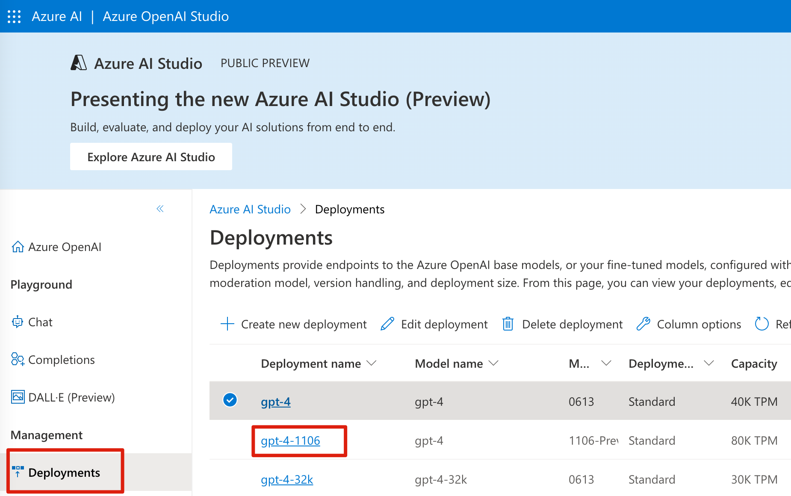
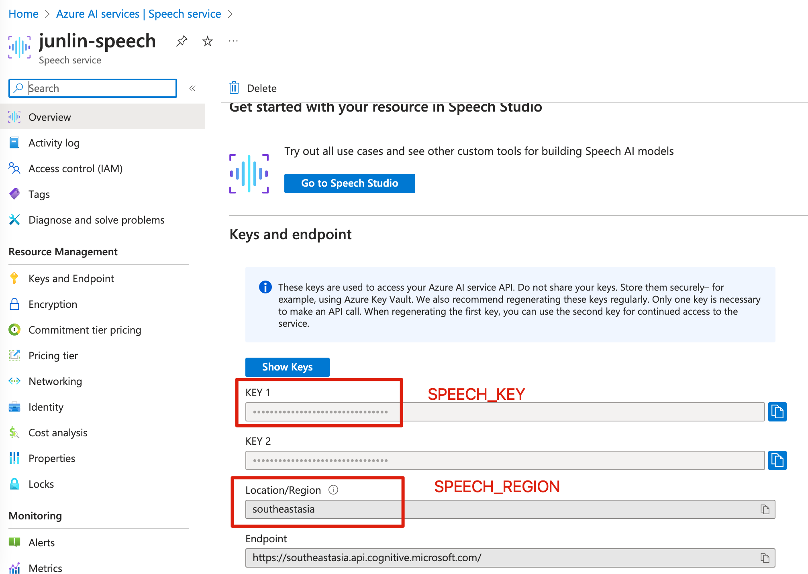

# ChatGPT-Azure-Speech

This is a demonstration application that leverages the capabilities Azure Speech Service to enable users to talk with ChatGPT . This repository hosts the codebase, instructions, and resources needed to set up and run the application.

## Features

- Use Azure Speech for ASR and TTS when talking with ChatGPT

## Installation

To get started, follow these steps:

1. Clone the repository:

```bash
git clone https://github.com/linjungz/chatgpt-azure-speech.git
```

2. Change into the `chatgpt-azure-speech` directory:

```bash
cd chatgpt-azure-speech
```

3. Install the required Python packages:

Create virtual environment:

```bash
python3 -m venv .venv
source .venv/bin/activate
```

Install depenancies:

```bash
pip install -r requirements.txt
```

## Configuration

1. Obtain your Azure OpenAI API key, Endpoint and Deployment Name from the [Azure Portal](https://portal.azure.com/).
2. Obtain your Azure Speech Key and Region from [Azure Portal](https://portal.azure.com/).
3. Create `.env` in the root dir and set the environment variables in the file:

```
OPENAI_API_BASE=https://your-endpoint.openai.azure.com
OPENAI_API_KEY=your-key-here
OPENAI_DEPLOYMENT=your-gpt-deployment-name
OPENAI_API_VERSION=2023-07-01-preview
SPEECH_KEY=your-key-here
SPEECH_REGION=region
```

### Azure OpenAI
Here's where you can find the deployment names for GPT:


For supported openai version, you could check this [link](https://learn.microsoft.com/en-us/azure/ai-services/openai/reference#chat-completions) for more information.

### Azure Speech
Here's where you can find key and region:

